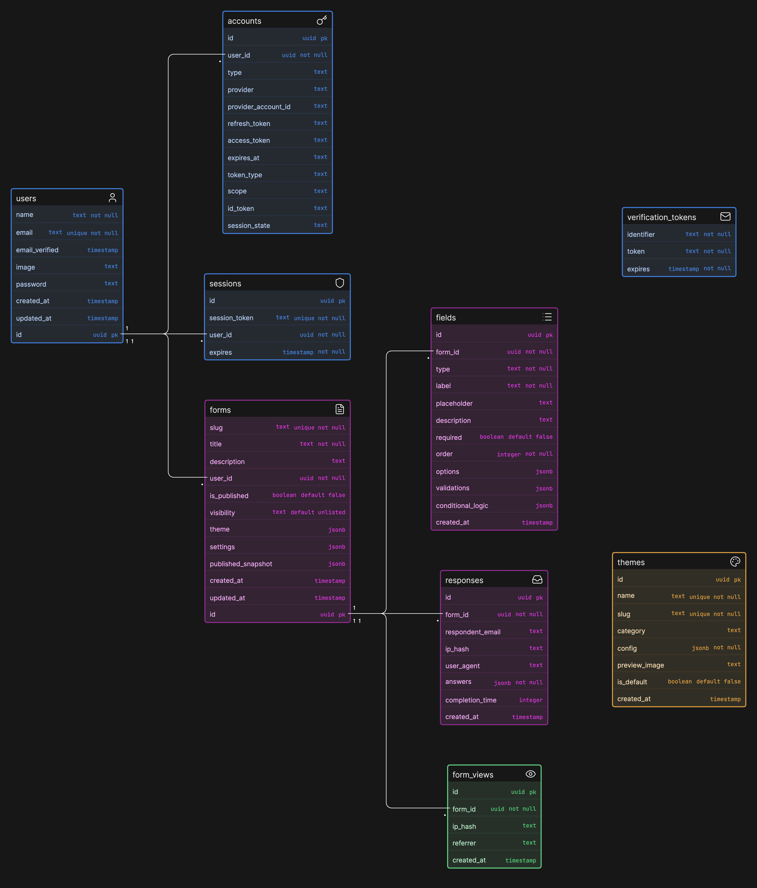

# FormForge

A full-stack form builder SaaS. Create, publish, and analyse forms with a drag-and-drop builder, real-time analytics, email notifications, and a public explore page.

## Demo

| Credential | Value                |
| ---------- | -------------------- |
| Email      | `demo@formforge.dev` |
| Password   | `Demo@1234`          |

Five sample forms are pre-seeded (3 public, 2 unlisted) with realistic responses and view counts.

---

## Tech Stack

| Layer         | Technology                         |
| ------------- | ---------------------------------- |
| Monorepo      | Turborepo + pnpm workspaces        |
| Frontend      | Next.js 16 (App Router, Turbopack) |
| Backend       | Express + tRPC v11                 |
| Database      | PostgreSQL + Drizzle ORM           |
| Auth          | NextAuth v5 (JWT)                  |
| Email         | Resend + React Email               |
| Charts        | Recharts                           |
| QR Codes      | qrcode.react                       |
| Rate limiting | Upstash Redis (in-memory fallback) |
| Styling       | Tailwind CSS + shadcn/ui           |

---

## Project Structure

```
formforge/
├── apps/
│   ├── web/          # Next.js frontend (port 3000)
│   └── api/          # Express + tRPC server (port 3001)
├── packages/
│   ├── database/     # Drizzle schema, migrations, seed
│   ├── trpc/         # tRPC router definitions
│   ├── email/        # React Email templates + Resend
│   ├── schemas/      # Shared Zod schemas
│   ├── utils/        # Shared utilities
│   └── services/     # Shared services
```

---

## ER Diagram



---

## Features

- **Form builder** — drag-and-drop field ordering, 10 field types, conditional logic
- **Theming** — 10 preset themes, custom colours, fonts, border radii, button styles
- **Analytics** — response trend (30-day line chart), field-level stats (bar chart), top referrers
- **Responses** — paginated table with expand/collapse, date filters, CSV export
- **Email notifications** — new-response alert to form owner, submission confirmation to respondent
- **Custom slugs** — change the public URL for any form
- **Expiry dates** — forms automatically stop accepting responses after a set date
- **Password protection** — gate forms behind a password (bcrypt-hashed)
- **QR code** — download SVG QR code for any form from the settings page
- **Clone** — duplicate a form with all its fields
- **Explore page** — browse public forms with full-text search and featured section
- **Rate limiting** — 5 submissions per IP per hour per form

---

## Local Development

### Prerequisites

- Node.js 20+
- pnpm 9+
- PostgreSQL 15+ (or use the included `docker-compose.yml`)

### Setup

```bash
# 1. Clone and install
git clone <repo-url>
cd formforge
pnpm install

# 2. Start Postgres
docker-compose up -d

# 3. Copy and fill environment files
cp .env.example apps/web/.env.local
cp .env.example apps/api/.env
# Edit both files with your DATABASE_URL, AUTH_SECRET, etc.

# 4. Push schema and seed demo data
pnpm --filter @formforge/db db:push
pnpm --filter @formforge/db seed

# 5. Start everything
pnpm dev
```

Open [http://localhost:3000](http://localhost:3000) and log in with the demo credentials above.

### Environment Variables

See [`.env.example`](.env.example) for all variables. Required ones:

| Variable              | Description                                     |
| --------------------- | ----------------------------------------------- |
| `DATABASE_URL`        | PostgreSQL connection string                    |
| `AUTH_SECRET`         | 32-char random secret (`openssl rand -hex 32`)  |
| `NEXT_PUBLIC_APP_URL` | Frontend URL (default: `http://localhost:3000`) |

Optional (graceful fallbacks in dev):

| Variable                   | Description                         | Fallback                            |
| -------------------------- | ----------------------------------- | ----------------------------------- |
| `RESEND_API_KEY`           | Resend API key for email            | Logs to console                     |
| `EMAIL_FROM`               | Sender address                      | `FormForge <noreply@formforge.dev>` |
| `UPSTASH_REDIS_REST_URL`   | Upstash Redis URL for rate limiting | In-memory                           |
| `UPSTASH_REDIS_REST_TOKEN` | Upstash Redis token                 | In-memory                           |

---

## Deployment

Both frontend and backend are deployed on [Render](https://render.com). Database on [Neon](https://neon.tech).

### Step 1 — Database (Neon)

1. Create a free project at [neon.tech](https://neon.tech)
2. Copy the connection string from the dashboard
3. Run migrations and seed from your local machine:

```bash
DATABASE_URL="postgresql://..." pnpm db:migrate
DATABASE_URL="postgresql://..." pnpm db:seed
```

### Step 2 — Deploy on Render

1. Go to [render.com](https://render.com) → **New → Blueprint**
2. Connect your GitHub repo — Render will detect `render.yaml` and create both services automatically
3. Set environment variables for each service:

> API docs: `https://formforge-builder-api.onrender.com/docs`

> ⚠️ Render free tier spins down after 15 min of inactivity. Open both URLs before a demo to warm them up.

---

## Scripts

| Command                              | Description                   |
| ------------------------------------ | ----------------------------- |
| `pnpm dev`                           | Start web + api in watch mode |
| `pnpm build`                         | Build all apps and packages   |
| `pnpm --filter @formforge/db studio` | Open Drizzle Studio           |
| `pnpm --filter @formforge/db seed`   | Seed demo data                |
| `pnpm --filter @formforge/web lint`  | Lint frontend                 |
